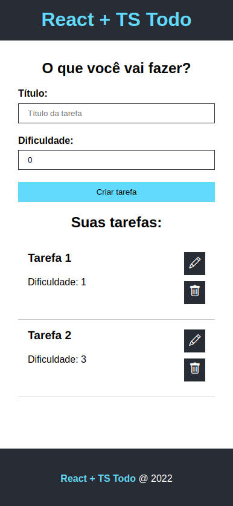

# React + TS Todo

## Sobre o projeto

  

React + TS Todo é uma aplicação web responsiva que consiste em um sistema de lista de tarefas, onde é possível criar, editar, e excluir tarefas.

Acesse o projeto: http://todo-typescript-react.vercel.app/

## 🚀 Tecnologias utilizadas

Esse projeto foi desenvolvido com as seguintes tecnologias:

- TypeScript
- React
- CSS Modules

## :memo: Licença

Esse projeto está sob a licença MIT. Veja o arquivo [LICENSE](LICENSE) para mais detalhes.

## Autor

Hudson Santos

https://www.linkedin.com/in/hudsonsamuelsantos
